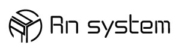

### 👋 Hi, I'm Ryoma U.

System Engineer / Python Developer | DX Promoter

業務効率化・データ連携システム開発を中心に、
**現場に寄り添ったDX推進**を実践しています。

- 🔧 Python（Flask / Django）による業務改善システム開発
- 🧩 FileMaker / Shopify / n8n を活用した **SaaS連携・自動化設計**
- 📊 Webアプリ・API連携でデータ活用を最大化
- 🚀 少人数～単独でも幅広い領域を推進（要件定義→設計→開発→運用）

業務理解からスタートし、
課題の洗い出し、仕組み化、改善サイクルまでを一貫して担当。  
多業種のプロジェクトにも積極的に参加し、  
**スキルの標準化と再現性あるDX**を目指し続けています。

日々「できることを増やす」ではなく、  
「できたことを仕組みに変える」を理念に、  
シンプルで長く使い続けられるソリューションを開発しています。

---

### 🔗 Skills & Tools
Python / Flask / Django / JavaScript  
FileMaker / Shopify / n8n / Slack API  
MySQL / PostgreSQL / ODBC / REST API  
GitHub / Linux / Docker / CI/CD  

---

### 📌 Featured Projects (Pinned)
- Shopify自動化 & 顧客データ管理システム
- Webアプリ：在庫検索 / 通知機能
- DX推進のための業務改善ツール各種（API連携 / 自動レポート生成 など）

---

### 📬 Contact
- Portfolio：https://www.rnsystem.jp
- contact form:https://www.rnsystem.jp/contact
- Sub Jobs：https://coconala.com/users/1172887
- Email：ryohma@rnsystem.jp

---

